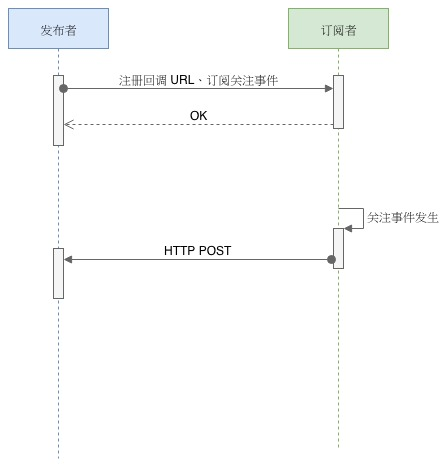

## 概念

### 什么是 WebHook？

WebHook，网络钩子，就是一个 HTTP 回调，一个简单的基于 HTTP POST 的事件通知。

WebHook 这个词是由杰夫·林德赛（Jeff Lindsay）于 2007 年首次提出，创意来自编程术语 “Hook”。

### WebHook 能干嘛？

1. 推送（Push）：实时接收数据；不需要轮询，当事件发生时 Web 应用会推送通知。
2. 管道（Pipeline）：接收并传递数据；当接收到通知时，对方可以编程将数据通过各种方式传递出去。
3. 插件（Plugin）：处理数据并响应；将整个互联网变成一个可编程平台。

## 工作过程

其工作流程就是一个发布-订阅模型，或者说是 Web 上的观察者模式。试画简要的时序图如下：

## 实现

目前 WebHook 的实现没有统一的标准。但 [webhooks.pbworks.com](https://webhooks.pbworks.com/w/page/13385128/RESTful%20WebHooks) 提供了一种基于 RESTful 的 WebHooks 实现标准。包括发现、订阅、发布等一系列的规范。

实现 WebHook 时需要关注：

1. 事件（Events），该 Web 应用可提供多少种事件用于订阅；
2. 载荷（Payload），各种事件的通知实体是怎样的，有哪些字段；

更细微的还需要关注：

1. 在通知中说明收到通知的原因——是由于哪个事件触发的，Github 中是使用请求头 `X-GitHub-Event` 说明；
2. 唯一标识每个通知，Github 是使用请求头 `X-GitHub-Delivery` 说明；
3. 如有需要，进行签名校验保证请求和响应内容未被修改，Github 中是使用请求头 `X-Hub-Signature` 说明。

## 参考

1. [WebHooks Wiki Home](https://webhooks.pbworks.com/FrontPage)
2. [网络钩子 - 维基百科](https://zh.m.wikipedia.org/wiki/%E7%BD%91%E7%BB%9C%E9%92%A9%E5%AD%90)
3. [Introduction to Webhooks and An Evangelist - nearsoft.com](https://nearsoft.com/blog/introduction_to_webhooks_and_an_evangelist/)
4. [RESTful WebHooks - webhooks.pbworks.com](https://webhooks.pbworks.com/w/page/13385128/RESTful%20WebHooks)
5. [Webhooks - developer.github.com](https://developer.github.com/webhooks/#ping-event)
6. [Webhooks do’s and dont’s: what we learned after integrating +100 APIs - restful.io](https://restful.io/webhooks-dos-and-dont-s-what-we-learned-after-integrating-100-apis-d567405a3671)