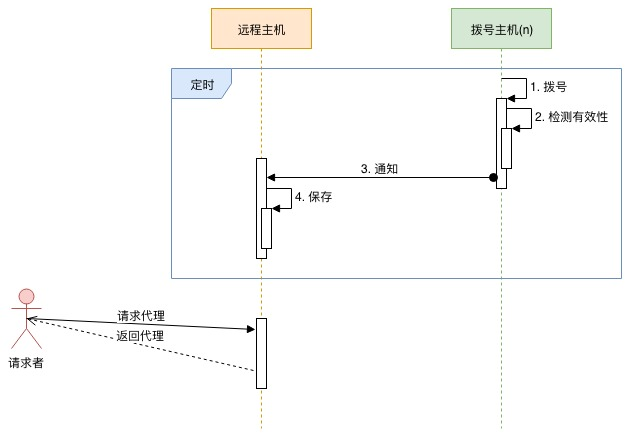

## 1 原理

### 1.1 ADSL 技术

**ADSL** (**A**symmetric **D**igital **S**ubscriber **L**ine，非对称数字用户线路) 技术。

采用频分多路复用技术把普通电话线分成电话、上行和下行三个相对独立的信道，信道之间不会互相干扰。

技术局限：

1. 在不影响正常通话通信情况下，上行速度最高 3.5Mbps
2. 在不影响正常通话通信情况下，下行速度最高 24Mbps
3. 电信服务提供商接入设备和用户终端之间的距离不能超过 5 公里

网络登录标准：

| 标准  | 含义                                                         | 是否提供动态 IP |
| ----- | ------------------------------------------------------------ | --------------- |
| STM   | Synchronous Transport Module，同步传输模块                   | 否              |
| ATM   | Asynchronous Transfer Mode，异步传输模式                     | 否              |
|       | Packet Transfer Mode (始于 ADSL 2版本，如下)                 |                 |
| PPPoA | **P**oint-to-**P**oint **P**rotocol **o**ver **A**TM，基于 ATM 的端对端协议 | 是              |
| PPPoE | **P**oint-to-**P**oint **P**rotocol **o**ver **E**thernet，基于以太网的端对端协议 | 是              |

PPP，点对点协议：

工作在数据链路层，在两个节点之间创建直接的连接，并提供认证、传输加密和压缩功能。

PPP 应用：

1. 宽带接入，拨号接入，使用 PPPoE 和 PPPOA 协议解决 IP 报文在没有数据链路协议时在调制调节器线路传输的问题；
2. 物理网络，包括串口线、电话线、移动电话和光纤等。

> 宽带（Broadband）：
>
> 1. OECD2006年报告称，任何传输速率在256Kbps以上的互联网连接，可称为宽带。
> 2. FCC解释，任何传输速率在4Mbps以上的互联网连接，可称为宽带。

PPPoE：

将 PPP 协议封装在以太网框架中的一种网络隧道协议。

- 有登录和口令，方便计费；
- 当连接时分配 IP 地址，方便 IP 地址动态复用。

### 1.2 动态拨号 VPS

VPS (Virtual Private Server，虚拟专用服务器)，将一台服务器分割成多个虚拟专享服务器的服务。

动态拨号 VPS 是基于 ADSL 拨号上网的虚拟专用主机。

不同的动态拨号 VPS 提供商提供不同的配置方法：

| 动态拨号 VPS 提供商                               | 配置方式                                                     |
| ------------------------------------------------- | ------------------------------------------------------------ |
| [云立方](http://www.yunlifang.cn/dynamicvps.asp)  | 1. 运行 `ppp.sh` 脚本，输入用户名密码即可；<br/>2. `adsl-start ` 进行开始拨号，网卡为 ppp0；<br/>3. `adsl-stop` 停止拨号。 |
| [无极](http://cloud.871020.com/vpsadm/pppoe.html) | 1. 运行 `p.sh` 脚本，输入用户名密码即可；<br/>2. `pppoe-start` 拨号；<br/>3. `pppoe-stop` 停止拨号；<br/> 4. `pppoe-status` 查看拨号状态。 |

## 2 设置代理服务器

在 Linux 下搭建代理服务器有两种简单的方式，TinyProxy 和 Squid。

### 2.1 TinyProxy

#### （1）安装

```shell
# 在 CentOS 下
yum update -y
yum install -y epel-release
yum -y install tinyproxy
yum install vim -y
```

#### （2）配置

找到 `/etc/tinyproxy/tinyproxy.conf` 文件，将 `Allow 127.0.0.1`  改为允许外部连接的主机，如想任意主机都能连，只需要注释掉即可，即 `# Allow 127.0.0.1`。

保存配置后，需要重启才能生效，即执行 

```shell
systemctl restart  tinyproxy.service
systemctl enable tinyproxy.service
```

#### （3）设置防火墙

```shell
# 禁用 firewall
systemctl stop firewalld.service #停止firewall
systemctl disable firewalld.service #禁止firewall开机启动
# 安装 iptables
yum -y install iptables-services
# 编辑 iptables 配置
vi /etc/sysconfig/iptables
## 添加配置项
-A INPUT -m state --state NEW -m tcp -p tcp --dport 3306 -j ACCEPT
# 重启 iptables
systemctl restart iptables.service #重启防火墙使配置生效
systemctl enable iptables.service #设置防火墙开机启动
# 重启系统
```

#### （4）关闭 SELinux

```shell
# 编辑 selinux 配置
vi /etc/sysconfig/selinux
# 修改配置项目
SELINUX=disabled
# 保存
```

#### （5）验证

```shell
curl -x <主机地址> httpbin.org/get
```

## 3 动态获取 IP

使用一台远程主机作为接口，接收并保存拨号主机的 IP 变更，然后对外提供代理接口。具体时序图如下：



示例：自动拨号脚本

> 环境：python3, pip3 install tornado requests apscheduler

```python
# sender.py
# coding=utf-8
import platform
import re
import time

import requests
from requests.exceptions import ConnectionError, ReadTimeout

from adslproxy.config import *

if platform.python_version().startswith('2.'):
    import commands as subprocess
elif platform.python_version().startswith('3.'):
    import subprocess
else:
    raise ValueError('python version must be 2 or 3')


class Sender():
    def get_ip(self, ifname=ADSL_IFNAME):
        """
        获取本机IP
        :param ifname: 网卡名称
        :return:
        """
        (status, output) = subprocess.getstatusoutput('ifconfig')
        if status == 0:
            pattern = re.compile(ifname + '.*?inet.*?(\d+\.\d+\.\d+\.\d+).*?netmask', re.S)
            result = re.search(pattern, output)
            if result:
                ip = result.group(1)
                return ip

    def test_proxy(self, proxy):
        """
        测试代理
        :param proxy: 代理
        :return: 测试结果
        """
        try:
            response = requests.get(TEST_URL, proxies={
                'http': 'http://' + proxy,
                'https': 'https://' + proxy
            }, timeout=TEST_TIMEOUT)
            if response.status_code == 200:
                return True
        except (ConnectionError, ReadTimeout):
            return False

    def set_proxy(self, proxy):
        """
        设置代理
        :param proxy: 代理
        :return: None
        """
        try:
            response = requests.post(
                "{}?server={}".format(POSTBACK_URL, CLIENT_NAME), json=proxy)
            if response.status_code == 200:
                print('Successfully Set Proxy', proxy)
                return True
        except(ConnectionError, ReadTimeout):
            return False

    def adsl(self):
        """
        拨号主进程
        :return: None
        """
        while True:
            print('ADSL Start, Remove Proxy, Please wait')
            (status, output) = subprocess.getstatusoutput(ADSL_BASH)
            if status == 0:
                print('ADSL Successfully')
                ip = self.get_ip()
                if ip:
                    print('Now IP', ip)
                    print('Testing Proxy, Please Wait')
                    proxy = {"host": ip, "port": PROXY_PORT, "ttl": ADSL_CYCLE}
                    if self.test_proxy(proxy):
                        print('Valid Proxy')
                        self.set_proxy(proxy)
                        print('Sleeping')
                        time.sleep(ADSL_CYCLE)
                    else:
                        print('Invalid Proxy')
                else:
                    print('Get IP Failed, Re Dialing')
                    time.sleep(ADSL_ERROR_CYCLE)
            else:
                print('ADSL Failed, Please Check')
                time.sleep(ADSL_ERROR_CYCLE)


def run():
    sender = Sender()
    sender.adsl()


if __name__ == '__main__':
    run()

```

```python
# config.py
# coding=utf-8
# 拨号间隔
ADSL_CYCLE = 100

# 拨号出错重试间隔
ADSL_ERROR_CYCLE = 5

# ADSL命令
ADSL_BASH = 'adsl-stop;adsl-start'

# 代理运行端口
PROXY_PORT = 8888

# 客户端唯一标识
CLIENT_NAME = 'ylf_gd_lt_1'

# 拨号网卡
ADSL_IFNAME = 'ppp0'

# 测试URL
TEST_URL = 'http://www.baidu.com'

# 测试超时时间
TEST_TIMEOUT = 20

# 回传 URL
POSTBACK_URL = 'http://localhost:8081/v1/hook/adsl'

```

运行：

```shell
# 直接运行
python3 sender.py
# 守护运行
(python3 sender.py > /dev/null &)
(python3 sender.py > run.log &)
```

